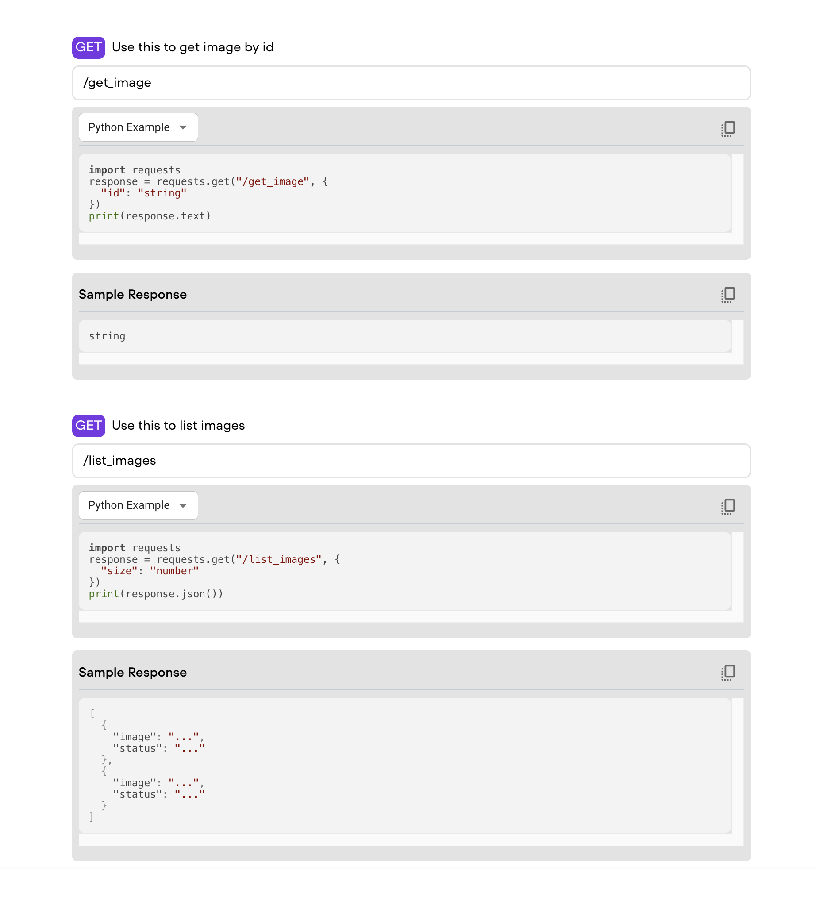

<div align="center">
    <h1>
        Lightning API Access UI Component
    </h1>
    

<div align="center">

<p align="center" style="color:grey">Enable users to engage with your app via an API</a></p>

______________________________________________________________________


<p align="center">
  <a href="#getting-started">Getting Started</a> •
  <a href="https://www.lightning.ai/">Lightning AI</a> •
  <a href="https://lightning.ai/components">Lightning Component Gallery</a>
</p>

[](https://www.pytorchlightning.ai/community)
[](https://github.com/Lightning-AI/lightning/blob/master/LICENSE)

</div>
</div>

______________________________________________________________________


# API Access Frontend Component

This component allows you to enable users to engage with your app via an API. It is a simple component that allows you to create an UI guide on how to send requests to your App APIs. The component is built with [Lightning's StaticWebFrontend](https://lightning.ai/lightning-docs/api_reference/generated/lightning_app.frontend.web.StaticWebFrontend.html) and [React](https://reactjs.org/) for the interface.


## Getting Started

### Installation

```bash
lightning install component git+https://github.com/Lightning-AI/LAI-API-Access-UI-Component.git@main
```

Or to build locally

```bash
git clone https://github.com/Lightning-AI/LAI-API-Access-UI-Component

cd LAI-API-Access-UI-Component
pip install .
```

### Usage

Here's a small [snippet](https://github.com/Lightning-AI/LAI-API-Access-UI-Component/blob/main/examples/example_app.py#L9) showing how to use the component in your App:

```python
class ServeWork(L.LightningWork):
    def __init__(self, **kwargs):
        super().__init__(parallel=True, cache_calls=True, **kwargs)

    def run(self):
        print(f"Serving on {self.host}:{self.port}")
        while True:
            time.sleep(1000)


class ExampleApp(L.LightningFlow):
    def __init__(self):
        super().__init__()

        self.serve_work = ServeWork()

    def run(self):
        self.serve_work.run()

    def configure_layout(self):
        return APIAccessFrontend(
            apis=[
                {
                    "name": "get image by id",
                    "url": f"{self.serve_work.url}/get_image",
                    "method": "GET",
                    "request": {"id": "string"},
                    "response": "string",
                },
                {
                    "name": "list images",
                    "url": f"{self.serve_work.url}/list_images",
                    "method": "GET",
                    "request": {"size": "number"},
                    "response": [{"image": "...", "status": "..."}, {"image": "...", "status": "..."}],
                },
                {
                    "name": "resize image",
                    "url": "/resize",
                    "method": "POST",
                    "request": {"size": "number"},
                    "response": {"image": "...", "status": "..."},
                },
            ]
        )


app = L.LightningApp(ExampleApp())
```

### Interface

Once you run the App, you should see the following interface.

<div align="center">
    
<div align="center">
